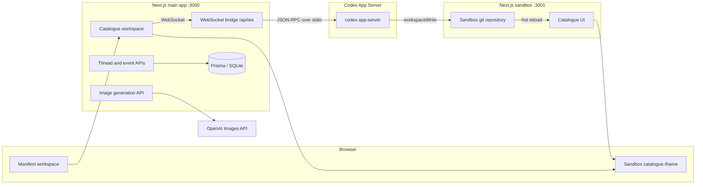

# Manifest Architecture

Manifest is a two-process local application for iterating on a product catalogue with an agent-driven editing loop. The main app owns authentication, persistence, the agent event stream, rollback/reset controls, and image generation. The sandbox app is the catalogue that Codex edits.

## Main App

The main app runs on port `3000`. It uses Next.js App Router, NextAuth, Prisma, and SQLite. Authenticated users open `/catalogue`, which starts the WebSocket bridge and renders the sandbox in an iframe.

Agent events flow through `src/lib/event-bus.ts` and `/api/ws`. Unknown App Server events are forwarded to the debug stream instead of failing the UI, so new event types remain inspectable while the app keeps running.

## Sandbox App

The sandbox runs as a separate Next.js app on port `3001`. Its source lives under `sandbox/`, and the Codex App Server is only granted `workspaceWrite` access to that directory. The iframe always points at the sandbox dev server, so file changes hot-reload independently from the main app.

The sandbox directory is also a git repository at runtime. `npm run sandbox:init` creates that repository for fresh clones and tags the original catalogue state as `baseline`. Rollback uses the current sandbox git state to decide whether to discard uncommitted edits or move back one committed feature. Reset hard-resets to `baseline`, removes untracked files, and restarts the App Server.

## Image Generation

Generated product imagery starts from committed base images in `sandbox/public/images/*-base.png`. `/api/images/generate` checks moderation, edits the selected base image with OpenAI image generation, writes the generated file beside the base image, and returns a URL that the sandbox can apply immediately. Generated image files are ignored by git.

## Persistence

Prisma stores users, sessions, threads, feature requests, and captured App Server events in SQLite. The default local database path is `data/dev.db`, which is ignored so local runs do not leak state into commits.
