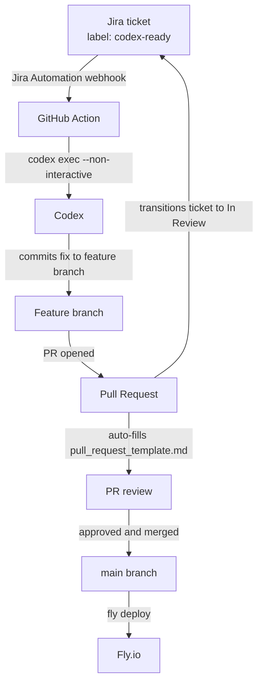
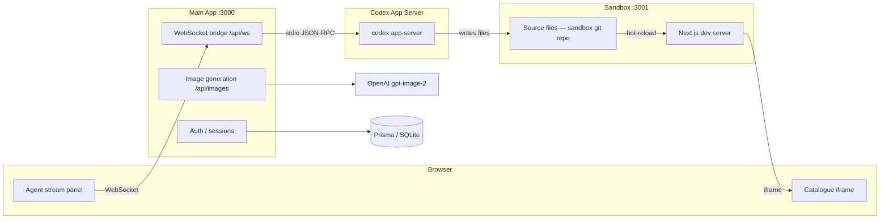

# Architecture

## CI / CD Pipeline

This diagram shows how a Jira ticket flows through to a deployed change — the canonical Codex + Jira integration pattern described in Part 1 of the assignment, made concrete in this repo.

The shared configuration lives entirely in the repo — the GitHub Action YAML, `AGENTS.md`, and the Skills under `.agents/skills/` — so every engineer on the team gets the same Codex behaviour without any per-machine setup.

The PR template (`.github/pull_request_template.md`) captures the Codex thread ID and original feature prompt so every machine-written PR is auditable: reviewers can trace exactly what was asked and replay the session in the Debug tab.

## App Architecture

The App Server's `workspaceWrite` sandbox is scoped to `./sandbox/` only — it cannot write outside that directory. The sandbox is its own git repository: every completed Codex turn produces one commit, giving a full rollback history. The `baseline` tag marks the initial state; "Reset to baseline" (`POST /api/reset`) resets to that tag regardless of how many commits have accumulated.
