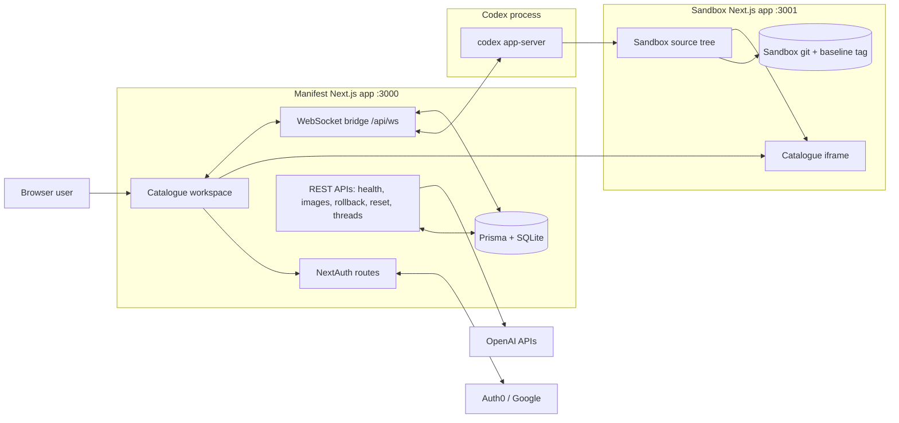

# Manifest

Manifest is a local, agent-assisted product catalogue workspace. The main app provides auth, prompts, event streaming, rollback/reset controls, debug history, and image generation. A separate sandbox catalogue runs in an iframe so Codex can rewrite catalogue source files while the user watches changes hot-reload.

## Architecture



## Tech Stack

- Next.js 15 App Router, React 19, TypeScript, Tailwind CSS
- NextAuth with Prisma adapter
- Prisma with SQLite for local persistence
- Vitest and Testing Library
- Codex App Server for agent-driven sandbox edits
- OpenAI APIs for transcription, moderation, and image generation

## Local Setup

Use Node 20.

```bash
npm ci
cd sandbox && npm ci
cd ..
cp .env.example .env
npx prisma migrate deploy
npx prisma generate
npm run sandbox:init
```

Fill in `.env` or `.env.local` with the values that match your environment. Both files are ignored by git.

For local development without OAuth, set `DEBUG_AUTH=true`. For Auth0/Google testing, set `DEBUG_AUTH=false`, provide the Auth0 variables, and add this callback URL in Auth0:

```text
http://localhost:3000/api/auth/callback/auth0
```

## Environment Variables

| Variable | Required | Description |
| --- | --- | --- |
| `OPENAI_API_KEY` | Yes | Used by OpenAI API routes for moderation, transcription, and image generation. |
| `CODEX_API_KEY` | Yes | Used by `codex app-server`; usually the same value as `OPENAI_API_KEY`. |
| `DATABASE_URL` | Yes | SQLite URL. Local default is `file:../data/dev.db`. |
| `NEXTAUTH_SECRET` | Yes | Secret for NextAuth session signing. Generate with `openssl rand -base64 32`. |
| `NEXTAUTH_URL` | Yes | Local URL, usually `http://localhost:3000`. |
| `AUTH0_CLIENT_ID` | OAuth only | Auth0 application client ID. |
| `AUTH0_CLIENT_SECRET` | OAuth only | Auth0 application client secret. |
| `AUTH0_ISSUER` | OAuth only | Auth0 issuer URL, for example `https://example.us.auth0.com`. |
| `DEBUG_AUTH` | Local only | Set to `true` to bypass OAuth in local debug mode. |
| `LOCAL_DEBUG_AUTH` | Local npm only | Set to `false` when running `npm run dev:local` to test Auth0 instead of forced debug auth. |
| `NEXT_PUBLIC_SANDBOX_PUBLIC_URL` | Optional | Browser URL for the iframe. Local default is `http://localhost:3001/`. |
| `SANDBOX_INTERNAL_URL` | Optional | Server-side sandbox health/image URL. Local default is `http://localhost:3001`. |
| `SANDBOX_NEXT_DEV_BUNDLER` | Optional | Sandbox dev bundler. Docker defaults to `webpack` for predictable file watching. |

## Development

During active iteration, use the npm runner. It applies pending Prisma migrations, generates Prisma Client, initializes the sandbox git baseline, and starts the Manifest and sandbox dev servers together without rebuilding Docker images. It forces debug auth by default so `/catalogue` opens without Auth0 while the app is stabilizing.

```bash
npm run dev:local
```

To test Auth0 with the npm runner, set `LOCAL_DEBUG_AUTH=false` and provide the Auth0/NextAuth environment variables.

```bash
LOCAL_DEBUG_AUTH=false npm run dev:local
```

Open:

- Main app: `http://localhost:3000/catalogue`
- Baseline catalogue: `http://localhost:3000/baseline`
- Sandbox app: `http://localhost:3001`

If you prefer separate terminals, run:

```bash
npm run dev
cd sandbox && sh serve-dev.sh
```

Useful commands:

```bash
npm run smoke:local
npm run verify
npm run lint
npm run typecheck
npm run test:run
npm run build
```

`npm run verify` runs the same local quality gates as CI: lint, typecheck, main app tests/build, and sandbox tests/build.

## Core Workflows

- **Feature requests:** submit a prompt in `/catalogue`; the WebSocket bridge starts or reuses a Codex thread, streams progress, commits sandbox changes when the turn completes, and preserves the prompt if the request fails before completion.
- **Undo and reset:** undo rolls back the last applied feature commit in the sandbox git repository; reset hard-resets the sandbox to the `baseline` tag, clears generated image outputs, restarts the App Server, and refreshes the iframe.
- **Image Studio:** generate product imagery from committed base images, preview it full-size, and apply the selected image override to the sandbox without changing source files.
- **Diagnostics:** expand the bottom diagnostics panel to inspect newest-first agent progress, file changes, command output, and raw event JSON when needed.

## Docker

Docker is the shipping-confidence path, not the fast iteration path. Use it once the npm workflow is stable and you want to prove the production-like container shape. The Docker setup runs the production Manifest app, sandbox Next dev server, WebSocket bridge, Codex app-server, SQLite data, and mutable sandbox git working tree in one container.

```bash
docker compose up --build
```

Compose defaults to Auth0. Export these before starting:

```bash
export NEXTAUTH_SECRET="$(openssl rand -base64 32)"
export AUTH0_CLIENT_ID="..."
export AUTH0_CLIENT_SECRET="..."
export AUTH0_ISSUER="https://<your-domain>.auth0.com"
export OPENAI_API_KEY="sk-..."
export CODEX_API_KEY="${CODEX_API_KEY:-$OPENAI_API_KEY}"
```

For a no-OAuth local smoke run, opt into debug auth explicitly:

```bash
DOCKER_DEBUG_AUTH=true NEXTAUTH_SECRET=manifest-debug-secret docker compose up --build
```

Open:

- Main app: `http://localhost:3000/catalogue`
- Sandbox app: `http://localhost:3001`
- WebSocket bridge: `ws://localhost:3002/api/ws`

Useful Docker checks:

```bash
docker compose ps
npm run smoke:docker
docker compose logs app
```

CI publishes successful `main` builds to GHCR:

- `ghcr.io/sthwaites/manifest-app:latest`
- `ghcr.io/sthwaites/manifest-sandbox:latest`
- `ghcr.io/sthwaites/manifest-app:sha-<short-sha>`
- `ghcr.io/sthwaites/manifest-sandbox:sha-<short-sha>`

## CI and Codex Review

GitHub Actions runs linting, typechecking, runtime dependency audits, tests, production builds, and Docker image builds on pull requests and pushes to `main`. Pushes to `main` also publish app and sandbox container images to GitHub Container Registry.

The repository also includes an on-demand Codex PR review workflow. Comment `/codex-review` on a pull request, or run the `Codex PR Review` workflow manually, to ask Codex for a focused review of correctness, test coverage, Docker/runtime risk, security, and publication readiness. Configure either `CODEX_API_KEY` or `OPENAI_API_KEY` as a repository secret before using that workflow.

## Troubleshooting

- If `/catalogue` redirects to login during local development, set `DEBUG_AUTH=true`.
- If the laptop resumes with stale local processes, stop `npm run dev:local` and start it again.
- If the catalogue panel says "Sandbox unavailable" during npm development, run `npm run smoke:local` and inspect the terminal running `npm run dev:local`.
- If feature requests show app-server or bridge errors, confirm `OPENAI_API_KEY` or `CODEX_API_KEY` is set and inspect the Manifest terminal output.
- If reset fails, run `npm run sandbox:init` to recreate the sandbox git repository and `baseline` tag.
- If generated images do not appear, check `OPENAI_API_KEY`, moderation errors, and write access to `sandbox/public/images/`.

## License

Manifest is released under the MIT License. See [LICENSE](LICENSE).
